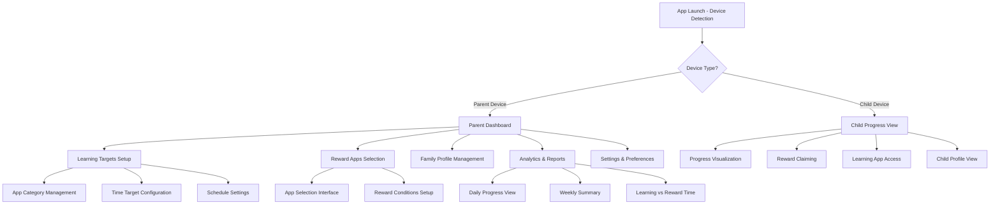
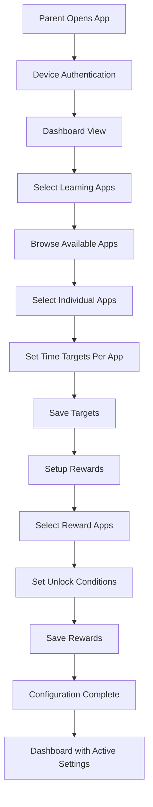

# ScreenTime Reward System UI/UX Specification

## Introduction

This document defines the user experience goals, information architecture, user flows, and visual design specifications for ScreenTime Reward System's user interface. It serves as the foundation for visual design and frontend development, ensuring a cohesive and user-centered experience.

### Overall UX Goals & Principles

#### Target User Personas
- **Parents of School-Age Children** (30-45 years old) - Primary decision-makers and administrators
- **Children** (Ages 6-12) - End users who engage with learning and reward apps

#### Key Usability Goals
- For Parents: Easy setup and management of learning targets and reward apps
- For Children: Clear visualization of progress and simple reward claiming process
- For Both: Intuitive navigation and age-appropriate interfaces

#### Core Design Principles
- Clarity over cleverness - Prioritize clear communication over aesthetic innovation
- Progressive disclosure - Show only what's needed, when it's needed
- Consistent patterns - Use familiar UI patterns throughout the application
- Immediate feedback - Every action should have a clear, immediate response
- Accessible by default - Design for all users from the start

## Information Architecture (IA)

For the ScreenTime Reward System, we need to create a comprehensive information architecture that addresses the needs of both our primary user groups: parents and children, with context-aware interfaces based on which device the app is launched on.

### Site Map / Screen Inventory

### Navigation Structure

**Primary Navigation:**
- For Parents (Parent Device): Dashboard with tabs for Targets, Rewards, Analytics, and Settings
- For Children (Child Device): Simple bottom navigation with Progress, Rewards, and Learning

**Secondary Navigation:**
- Contextual menus within each section
- Quick action buttons for common tasks

**Breadcrumb Strategy:**
- Not heavily needed due to simple hierarchy
- Back buttons for navigation between related screens

This revised architecture better reflects the context-aware nature of the application based on which device it's launched on. The feasibility study will determine exactly how much functionality can be accessed from each device type, but this structure allows for that flexibility.

## User Flows

### Parent Setup Flow

**User Goal:** Configure learning targets and reward apps for their child

**Entry Points:** 
- First-time app launch on parent device
- Returning to modify settings

**Success Criteria:** 
- Learning apps are selected and time targets are set per app
- Reward apps are selected and unlock conditions are defined
- Settings are saved and active

**Edge Cases & Error Handling:**
- Parent hasn't granted necessary permissions - Prompt for permissions with explanation
- No learning apps detected - Provide guidance on installing educational apps
- Invalid time targets (negative values, etc.) - Validation with clear error messages
- Network issues during setup - Local save with sync when connectivity restored

**Notes:** 
- All setup must be done on parent device per project requirements
- Changes should sync to child device in real-time when possible
- Setup wizard should guide parents through the process step-by-step
- Time targets are set per individual app rather than by category

## Wireframes & Mockups

### Design Files

**Primary Design Files:** Figma will be used for creating detailed visual designs and interactive prototypes.

### Key Screen Layouts

#### 1. Parent Dashboard Screen

**Purpose:** Central hub for parents to manage all settings and view analytics

**Key Elements:**
- Header with family profile selector
- Quick stats overview (today's learning time, rewards earned)
- Navigation tabs for Targets, Rewards, Analytics, Settings
- Quick action buttons for common tasks
- Recent activity feed

**Interaction Notes:** 
- Tab-based navigation for main sections
- Cards for quick stats with visual indicators
- Clear hierarchy of information with important actions prominent

**Design File Reference:** Will be created in Figma as the main dashboard design

#### 2. Learning App Selection Screen

**Purpose:** Allow parents to browse and select learning apps with time targets

**Key Elements:**
- Search and filter options for apps
- List/grid view of available apps with icons
- Time input fields for each selected app
- Visual indicators for apps already selected
- Save/cancel buttons

**Interaction Notes:**
- Multi-select capability for apps
- Real-time validation of time inputs
- Clear visual feedback for selected vs. unselected apps
- Sorting options (by name, recently used, etc.)

**Design File Reference:** Will be created in Figma as the app selection design

#### 3. Child Progress Screen

**Purpose:** Simple, engaging interface for children to view their progress

**Key Elements:**
- Progress visualization (circular or linear progress bar)
- Current learning session timer
- Reward status indicator
- Simple navigation between progress and rewards
- Child-friendly visuals and animations

**Interaction Notes:**
- Large, touch-friendly elements
- Immediate feedback on interactions
- Simple, clear progress indicators
- Minimal navigation to prevent distraction

**Design File Reference:** Will be created in Figma as the child interface design

## Component Library / Design System

### Design System Approach

**Design System Approach:** Create a custom design system that balances professional functionality for parents with child-friendly elements for the child interface. The system will be based on Apple's Human Interface Guidelines to ensure native feel on iOS/iPadOS while adding our own personality.

### Core Components

#### 1. Progress Indicator Component

**Purpose:** Visually represent learning progress and reward status

**Variants:** 
- Circular progress for child interface
- Linear progress for parent analytics
- Segmented progress for multiple learning apps

**States:** 
- Empty (0%)
- In progress (1-99%)
- Complete (100%)
- Claimed (for rewards)

**Usage Guidelines:** 
- Use circular variant for child-facing screens
- Use linear variant for parent analytics
- Include clear labels with time values
- Animate transitions for better feedback

#### 2. App Card Component

**Purpose:** Display individual apps in selection and management interfaces

**Variants:** 
- Learning app card
- Reward app card
- Mini app preview

**States:** 
- Default
- Selected
- Disabled
- Hover (where applicable)

**Usage Guidelines:** 
- Include app icon, name, and category
- Show time targets for learning apps
- Use color coding to differentiate app types
- Ensure touch targets are minimum 44px

#### 3. Time Input Component

**Purpose:** Allow parents to set time targets for learning apps

**Variants:** 
- Simple numeric input
- Picker with predefined options
- Slider for quick adjustments

**States:** 
- Empty
- Valid input
- Invalid input (with error messaging)
- Disabled

**Usage Guidelines:** 
- Default to 30 minutes for new learning apps
- Include validation for reasonable time values
- Provide quick select options (15, 30, 45, 60 minutes)
- Show time in consistent format (minutes or hours:minutes)

## Branding & Style Guide

### Visual Identity

**Brand Guidelines:** The visual identity should convey trust, education, and fun. We'll use a color palette that suggests growth and learning (greens and blues) with accent colors that feel rewarding and positive.

### Color Palette

| Color Type | Hex Code | Usage |
|------------|----------|-------|
| Primary | #4A90E2 | Main brand color, primary actions, navigation |
| Secondary | #7ED321 | Success states, progress completion, learning achievements |
| Accent | #F5A623 | Rewards, important notifications, calls to action |
| Success | #7ED321 | Positive feedback, confirmations, completed tasks |
| Warning | #F5A623 | Cautions, important notices, pending actions |
| Error | #D0021B | Errors, destructive actions, critical issues |
| Neutral | #F8F8F8, #E0E0E0, #9B9B9B, #4A4A4A | Text, borders, backgrounds, secondary elements |

### Typography

**Font Families:**
- **Primary:** SF Pro Display (iOS system font for native feel)
- **Secondary:** SF Pro Text (for body content)
- **Monospace:** SF Mono (for any code or technical displays)

**Type Scale:**

| Element | Size | Weight | Line Height |
|---------|------|--------|-------------|
| H1 | 34pt | Bold | 41pt |
| H2 | 28pt | Bold | 34pt |
| H3 | 22pt | Semibold | 28pt |
| Body | 17pt | Regular | 22pt |
| Small | 15pt | Regular | 20pt |

### Iconography

**Icon Library:** SF Symbols (Apple's native icon library) for consistency with iOS design language

**Usage Guidelines:** 
- Use filled variants for active states
- Use outlined variants for inactive states
- Maintain consistent sizing (default, medium, large)
- Ensure adequate touch targets (minimum 44px)

### Spacing & Layout

**Grid System:** 8pt grid system for consistent spacing and alignment

**Spacing Scale:** 
- XS: 4pt
- S: 8pt
- M: 16pt
- L: 24pt
- XL: 32pt
- XXL: 48pt

## Accessibility Requirements

### Compliance Target

**Standard:** WCAG 2.1 AA compliance with additional consideration for Apple's accessibility guidelines for iOS apps

### Key Requirements

**Visual:**
- Color contrast ratios: Minimum 4.5:1 for normal text, 3:1 for large text
- Focus indicators: Clear, visible focus rings for keyboard navigation
- Text sizing: Support for Dynamic Type with 7 text size options

**Interaction:**
- Keyboard navigation: Full keyboard access to all interactive elements
- Screen reader support: Proper labeling for VoiceOver with custom actions
- Touch targets: Minimum 44x44pt touch targets for all interactive elements

**Content:**
- Alternative text: Descriptive alt text for all informative images/icons
- Heading structure: Proper heading hierarchy for screen reader navigation
- Form labels: Associated labels for all form inputs with clear error messaging

**Testing Strategy:**
- Use Xcode's Accessibility Inspector for development testing
- Test with VoiceOver enabled on device
- Validate color contrast with accessibility tools
- Conduct user testing with people who have disabilities
- Implement automated accessibility tests in CI/CD pipeline

## Responsiveness Strategy

### Breakpoints

| Breakpoint | Min Width | Max Width | Target Devices |
|------------|-----------|-----------|----------------|
| Mobile | 320pt | 767pt | iPhone (all sizes) |
| Tablet | 768pt | 1023pt | iPad Mini, iPad Air |
| Desktop | 1024pt | 1365pt | iPad Pro 11", iPad Pro 12.9" |
| Wide | 1366pt | - | iPad Pro 12.9" (landscape) |

### Adaptation Patterns

**Layout Changes:**
- Mobile: Single column layout with tab-based navigation
- Tablet: Split view where appropriate with sidebar navigation
- Desktop: Multi-column layouts with expanded information density
- Wide: Full utilization of screen space with additional panels

**Navigation Changes:**
- Mobile: Bottom tab bar for primary navigation
- Tablet: Side navigation drawer or sidebar
- Desktop: Persistent sidebar navigation
- Wide: Combined top and side navigation for complex workflows

**Content Priority:**
- Mobile: Essential information only, progressive disclosure
- Tablet: Additional context and quick actions
- Desktop: Full information density with advanced controls
- Wide: Multi-tasking support with panels and widgets

**Interaction Changes:**
- Mobile: Touch-optimized targets and gestures
- Tablet: Support for both touch and keyboard interactions
- Desktop: Enhanced keyboard shortcuts and mouse interactions
- Wide: Multi-window and drag-and-drop support

## Animation & Micro-interactions

### Motion Principles

**Motion Principles:**
- Subtle and purposeful - animations should serve a functional purpose, not just decoration
- Fast but not jarring - aim for 200-300ms for most transitions
- Consistent easing - use standard iOS easing curves (easeInOut for most transitions)
- Meaningful feedback - provide visual feedback for all user actions
- Performance conscious - ensure animations don't impact app performance or battery life

### Key Animations

1. **Progress Completion Animation:** Visual feedback when a learning target is reached
   - Duration: 800ms
   - Easing: easeOut
   - Description: Celebratory animation when a child completes a learning target

2. **Reward Unlock Animation:** Visual feedback when a reward is unlocked
   - Duration: 1000ms
   - Easing: easeInOut
   - Description: Exciting animation sequence when a child earns access to a reward app

3. **Dashboard Data Loading:** Smooth loading of analytics data
   - Duration: 500ms
   - Easing: easeInOut
   - Description: Smooth transitions when loading or updating dashboard information

4. **App Selection Feedback:** Immediate feedback when selecting apps
   - Duration: 200ms
   - Easing: easeInOut
   - Description: Subtle scale and color change when selecting/deselecting apps

5. **Navigation Transitions:** Smooth transitions between screens
   - Duration: 300ms
   - Easing: easeInOut
   - Description: Standard screen transitions with parallax effects where appropriate

## Performance Considerations

### Performance Goals

- **Page Load:** Initial app launch in under 2 seconds
- **Interaction Response:** All user interactions respond in under 100ms
- **Animation FPS:** Maintain 60 FPS for all animations and transitions

### Design Strategies

- Minimize heavy graphics and animations that could impact battery life
- Optimize image assets for different screen densities
- Use efficient layouts that minimize rendering complexity
- Implement lazy loading for non-critical content
- Design lightweight interfaces that minimize memory usage
- Plan for efficient data synchronization between parent and child devices
- Optimize progress indicators and animations to run smoothly even during background processing
- Use system-standard components where possible to leverage iOS optimizations

## Next Steps

### Immediate Actions

1. Create detailed visual designs in Figma for all key screens based on this specification
2. Develop a clickable prototype to validate user flows and interactions
3. Conduct usability testing with target user groups (parents and children)
4. Refine the design system and component library based on testing feedback
5. Create detailed design specifications for the development team
6. Establish design handoff process with developers including assets and guidelines
7. Plan accessibility testing with users who have disabilities
8. Validate responsive designs across all target device sizes
9. Document animation specifications and micro-interaction details

### Design Handoff Checklist

- [ ] All user flows documented
- [ ] Component inventory complete
- [ ] Accessibility requirements defined
- [ ] Responsive strategy clear
- [ ] Brand guidelines incorporated
- [ ] Performance goals established
- [ ] Design assets exported and organized
- [ ] Interaction specifications documented
- [ ] Prototype links shared with development team

This front-end specification provides a comprehensive foundation for the ScreenTime Reward System's user interface. By following these guidelines, we can ensure a consistent, accessible, and engaging experience for both parents and children while maintaining technical performance standards.