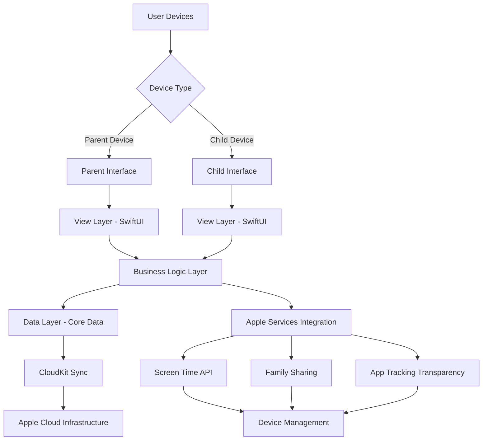

# ScreenTime Reward System - Full Stack Architecture

## Overview

This document outlines the technical architecture for the ScreenTime Reward System, a native iOS/iPadOS application that implements a reward-based screen time management system for children. The system motivates educational engagement by unlocking "Reward Apps" only after children complete designated duration targets on "Learning Apps".

The architecture is designed to work exclusively within Apple's ecosystem, utilizing native frameworks and services to ensure compatibility, security, and performance while maintaining all data within Apple's privacy-compliant infrastructure.

## System Context

### User Roles

1. **Parent Users**
   - Primary administrators of the system
   - Configure learning targets and reward apps
   - Monitor children's progress through analytics
   - Manage family accounts and settings
   - Access all system features from their device

2. **Child Users**
   - End users who engage with learning and reward apps
   - View progress toward learning goals
   - Claim earned rewards
   - Have restricted access to system features

### Device Context

The application operates in a dual-device context:
- **Parent Device**: Full administrative interface with complete system access
- **Child Device**: Restricted interface for viewing progress and claiming rewards

Both devices must be part of the same Apple Family Sharing group for proper synchronization and control.

## Architectural Goals and Constraints

### Goals

1. **Seamless Apple Integration**: Deep integration with Apple's Screen Time API, Family Sharing, and CloudKit
2. **Privacy Compliance**: Full compliance with COPPA, GDPR, and Apple's App Store guidelines
3. **Performance**: Minimal battery consumption (<5%) and app size (<50MB)
4. **Reliability**: Robust synchronization across devices using Apple's native frameworks
5. **Security**: End-to-end encryption of all sensitive family data
6. **Scalability**: Support for up to 5 child profiles per family account

### Constraints

1. **Apple-Only Ecosystem**: Exclusive use of Apple's native frameworks and services
2. **No Third-Party Services**: All data storage and processing must remain within Apple's ecosystem
3. **Parental Control Limitations**: Parents control all settings from their device; children have restricted interface
4. **Device Management Restrictions**: Working within Apple's private token and device management limitations
5. **App Store Compliance**: Must meet all Apple App Store review guidelines

## High-Level Architecture

## Technology Stack

### Frontend

- **Framework**: SwiftUI for modern, declarative UI components
- **Language**: Swift 5+
- **Design System**: Custom design system based on Apple's Human Interface Guidelines
- **Components**: 
  - Progress indicators for learning goals
  - App cards for app selection
  - Time input components for target setting
  - Dashboard components for analytics
  - Points balance visualization components

### Backend Services

- **Local Storage**: Core Data for on-device persistence
- **Cloud Storage**: CloudKit for cross-device synchronization
- **Authentication**: Apple Sign-In for family account management
- **Tracking**: Apple's Screen Time API for app usage monitoring
- **Notifications**: User Notifications framework for progress alerts
- **Security**: Apple's native encryption frameworks for data protection
- **Device Management**: Apple's Device Management API for app blocking

### Development Tools

- **IDE**: Xcode 12+
- **Version Control**: Git with GitHub
- **CI/CD**: GitHub Actions for automated testing and deployment
- **Testing**: XCTest for unit and integration testing
- **Distribution**: App Store Connect for beta testing and release management

## System Components

### 1. User Interface Layer

#### Parent Interface

**Components:**
- Dashboard with overview analytics
- Learning target configuration
- Reward app selection and setup
- Family profile management
- Detailed analytics and reporting
- Settings and preferences
- Reward points configuration
- App blocking controls

**Key Features:**
- Tab-based navigation for main sections
- Contextual menus for specific actions
- Real-time data visualization
- Responsive design for iPhone and iPad
- Points conversion rate configuration
- Reward redemption rate setup

#### Child Interface

**Components:**
- Progress visualization dashboard
- Reward claiming interface
- Learning app access portal
- Achievement display
- Points balance visualization

**Key Features:**
- Simple, touch-friendly interface
- Gamification elements and animations
- Restricted functionality (view-only)
- Age-appropriate design and interactions
- Points earning visualization
- Reward time availability display

### 2. Business Logic Layer

#### Core Modules

1. **Tracking Module**
   - Interfaces with Apple's Screen Time API
   - Monitors time spent on designated apps
   - Processes usage data for goal calculation
   - Handles background tracking limitations

2. **Reward System Module**
   - Manages reward app unlocking logic
   - Calculates earned rewards based on learning targets
   - Handles reward claiming process
   - Implements parent override capabilities
   - **Manages reward points system (NEW)**
   - **Calculates points based on learning time (NEW)**
   - **Converts points to reward time (NEW)**

3. **Family Management Module**
   - Manages parent and child profiles
   - Handles family account creation and maintenance
   - Implements access control between user roles
   - Manages device synchronization

4. **Analytics Module**
   - Collects and processes usage data
   - Generates progress reports and insights
   - Creates visualizations for parent dashboard
   - Implements data privacy controls

5. **Notification Module**
   - Sends progress updates to parents
   - Provides reward notifications to children
   - Handles system alerts and warnings
   - Manages notification preferences

6. **Device Control Module (NEW)**
   - Implements app blocking functionality
   - Manages authorized app lists
   - Integrates with Apple's device management APIs
   - Handles downtime scheduling

### 3. Data Layer

#### Local Storage (Core Data)

**Entities:**
- FamilyProfile: Family account information
- UserProfile: Individual user (parent/child) data
- AppCategory: Learning vs. reward app categorization
- AppUsage: Tracked app usage data
- LearningTarget: Configured learning goals
- RewardStatus: Earned and claimed rewards
- AnalyticsData: Processed analytics information
- **PointsConfiguration: Reward points conversion rates (NEW)**
- **RewardTimeBalance: Available reward time for each child (NEW)**
- **AuthorizedApps: List of apps allowed on child devices (NEW)**

**Key Features:**
- On-device persistence for offline functionality
- Data encryption using Apple's security frameworks
- Efficient querying for dashboard displays
- Migration support for future updates

#### Cloud Storage (CloudKit)

**Containers:**
- FamilyData: Shared family information
- UserData: User-specific settings and preferences
- TrackingData: Synchronized usage tracking
- AnalyticsData: Shared analytics reports
- **PointsData: Points configuration and balances (NEW)**

**Key Features:**
- Automatic synchronization across family devices
- Conflict resolution for concurrent updates
- Offline support with eventual consistency
- End-to-end encryption for sensitive data

### 4. Integration Layer

#### Apple Services Integration

1. **Screen Time API**
   - Request and manage usage tracking permissions
   - Retrieve app usage data in real-time
   - Handle API limitations and error conditions
   - Implement battery optimization strategies

2. **Family Sharing**
   - Set up and manage family groups
   - Implement parent-child access controls
   - Handle device synchronization
   - Manage private token distribution

3. **CloudKit**
   - Configure containers for data storage
   - Implement synchronization logic
   - Handle offline scenarios
   - Manage data encryption

4. **App Tracking Transparency**
   - Implement permission requests
   - Handle user consent management
   - Comply with privacy disclosure requirements
   - Manage data collection limitations

5. **Device Management API (NEW)**
   - Implement app blocking functionality
   - Manage authorized app lists
   - Handle downtime scheduling
   - Integrate with Apple's parental control frameworks

## Security Architecture

### Data Protection

1. **Encryption**
   - All sensitive data encrypted using Apple's native frameworks
   - End-to-end encryption for family data in CloudKit
   - Secure key management using Keychain Services

2. **Access Control**
   - Role-based access control (parent vs. child)
   - Device-specific permissions
   - Family group isolation

3. **Privacy Compliance**
   - COPPA compliance for children's data
   - GDPR compliance for European users
   - Apple App Store guideline adherence
   - Transparent data collection practices

### Authentication and Authorization

1. **User Authentication**
   - Apple Sign-In for family account creation
   - Biometric authentication for device access
   - Secure session management

2. **Device Authorization**
   - Family Sharing group validation
   - Device trust establishment
   - Remote management capabilities

## Performance Considerations

### Battery Optimization

1. **Background Processing**
   - Minimal background tracking to preserve battery
   - Efficient data processing algorithms
   - Smart polling intervals for API calls

2. **Resource Management**
   - Memory-efficient data structures
   - Lazy loading for non-critical components
   - Image optimization for UI elements

### Data Synchronization

1. **Conflict Resolution**
   - Last-write-wins strategy for simple conflicts
   - Manual resolution for complex conflicts
   - Audit trail for tracking changes

2. **Offline Support**
   - Local data persistence during offline periods
   - Queue-based synchronization when online
   - Conflict detection and resolution

## Scalability and Extensibility

### Horizontal Scaling

1. **Family Account Growth**
   - Support for up to 5 child profiles per family
   - Efficient data partitioning in CloudKit
   - Performance optimization for large families

2. **Feature Expansion**
   - Modular architecture for new features
   - Plugin system for third-party integrations
   - API design for future service extensions

### Vertical Scaling

1. **Data Volume Management**
   - Data archiving strategies for historical analytics
   - Efficient querying for large datasets
   - Caching mechanisms for improved performance

2. **Performance Optimization**
   - Asynchronous processing for non-critical operations
   - Database indexing for faster queries
   - Memory management for long-running processes

## Deployment Architecture

### Development Environment

1. **Local Development**
   - Xcode project with modular structure
   - Unit testing with XCTest
   - Simulator testing for various devices
   - Local Core Data stores for development

2. **Continuous Integration**
   - GitHub Actions for automated builds
   - Automated testing on multiple device simulators
   - Code quality checks and linting
   - Security scanning for dependencies

### Release Management

1. **Beta Testing**
   - TestFlight distribution for beta testers
   - Analytics for usage tracking during beta
   - Feedback collection and bug reporting
   - Performance monitoring in beta environment

2. **Production Deployment**
   - App Store Connect for release management
   - Phased rollout for new versions
   - Crash reporting and error monitoring
   - Performance metrics collection

## Monitoring and Analytics

### System Monitoring

1. **Error Tracking**
   - Crash reporting through Apple's diagnostic tools
   - Error logging for debugging
   - Performance metrics collection
   - User feedback integration

2. **Usage Analytics**
   - Feature usage tracking (parent-only)
   - Performance metrics collection
   - User engagement analysis
   - Retention tracking

### Privacy-Compliant Analytics

1. **Data Collection**
   - Opt-in analytics with clear disclosure
   - Aggregated data only for insights
   - No personally identifiable information
   - Compliance with all privacy regulations

2. **Insights Generation**
   - Usage pattern analysis
   - Feature effectiveness measurement
   - User journey optimization
   - Performance bottleneck identification

## Risk Mitigation

### Technical Risks

1. **Apple API Limitations**
   - Regular monitoring of API changes
   - Fallback mechanisms for restricted features
   - Alternative approaches for critical functionality
   - Close relationship with Apple developer support

2. **Privacy Compliance**
   - Regular privacy audits
   - Legal consultation for compliance
   - Transparent user communication
   - Data minimization practices

### Operational Risks

1. **App Store Approval**
   - Thorough guideline review before submission
   - Beta testing for policy compliance
   - Documentation for all features
   - Responsive communication with review team

2. **User Adoption**
   - User research and feedback integration
   - Onboarding optimization
   - Customer support system
   - Community building initiatives

## Future Considerations

### Phase 2 Enhancements

1. **Machine Learning Integration**
   - Recommendation engine for learning apps
   - Usage pattern prediction
   - Adaptive learning targets
   - Intelligent reward point suggestions

2. **Social Features**
   - Family leaderboard for multiple children
   - Achievement sharing (parent-controlled)
   - Educational content community

3. **Advanced Analytics**
   - Predictive analytics for learning outcomes
   - Comparative analysis with similar families
   - Educational impact measurement

### Long-term Vision

1. **Educational Platform Integration**
   - Partnership with educational content providers
   - Curriculum-based learning pathways
   - Teacher and school integration

2. **Corporate Wellness Solutions**
   - Remote learning family packages
   - Corporate wellness program integration
   - Healthcare provider partnerships

## Conclusion

This architecture provides a solid foundation for the ScreenTime Reward System, designed specifically to work within Apple's ecosystem while maintaining the highest standards of privacy, security, and performance. By leveraging Apple's native frameworks and services, we ensure compatibility, reliability, and compliance with all relevant guidelines and regulations.

The modular design allows for future expansion while the dual-interface approach addresses the distinct needs of both parent and child users. The focus on privacy compliance and data protection ensures we meet the trust expectations of our users while operating within the constraints of Apple's family control and privacy frameworks.

The addition of the reward points system and app blocking functionality makes this solution truly unique in the parental control space, providing parents with powerful tools to motivate educational engagement while maintaining complete control over their children's device usage.